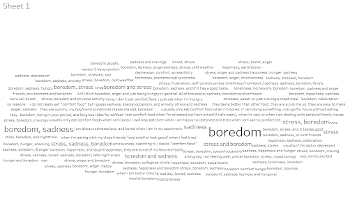

# 🧹 Подготовка данных опроса студентов для анализа их пищевых предпочтений

## Цель: 

- Удалить дубликаты и пропущенные значения
- Преобразовать текстовые и числовые поля
- Структурировать данные по типу вопроса и темам ответа
- Подготовить данные для последующего анализа.

## Исходные данные: 

### dataset Food preferences (Food choices) students of Mercyhurst University [источник](https://www.kaggle.com/datasets/borapajo/food-choices/data?select=food_coded.csv)

Результаты опроса 126 студентов университета (тест с вариантами ответа и развернутыми ответам о предпочтениях продуктов, пищевых привычках в детстве и в настоящее время).

## [Исходные данные в табличном формате](https://docs.google.com/spreadsheets/d/1kx7klKPtmaLdILoFCnxeXT9v0wgHgRPTa16DkyFe_1E/edit?usp=sharing)

## [Очищенные данные в табличном формате](https://docs.google.com/spreadsheets/d/1111zZMYINsikoUxW7WBZV2ZRpmkFfmN5d_n_vKA-6Jc/edit?usp=sharing)

файл с неочищенными данными  Food preferences

файл с очищенными данными  Food preferences cleaned
Порядок подготовки и очистки данных 
Этап предварительной очистки: удаление лишних пробелов в ячейках с текстовым форматом, выбор правильного формата для столбцов, поиск пустых значение и замена их на средние значения (при возможности), унификация регистра текста в ячейках для упрощения анализа информации.

## Change log (Version 1.0)
##Changes 
Данные-Очистка-Удалить пробелы
Удалены пробелы из текста столбцы H, I, N, Q, AC, AI, AJ, AQ, AA, AB

##Fix
Fix data type in columns A-G, J-M, O, P, R-X and all other columns with numbers from text to number. (function VALUE)

##Changes
Found empty cell in column A with data about GPA, decided to replace them with average meaning in that column (instrument conditional formatting and filtering)

##Changes
Column E “Calories per day”, found empty cells replace them by meaning 2 - it is not at all important. It is understandable that a person doesn’t answer the question because he doesn’t consider it important. (instrument conditional formatting and filtering)

##Changes
Column F, replace the meaning ‘nan’ with meaning 0.

##Changes
Made spellcheck of columns H,I, N, Q, Y, Z, AC, AI, AJ, AQ, AS, BE (Инструменты- проверка правописания)

#Changes
Found empty cells J108-J126 replace 9 - none, the question was  - comfort_food_reasons_coded, so if student didn't answer it means that there are no reasons for him (instrument conditional formatting and filtering)

#Changes
Column U replaced empty cells with answer 4 (other), the question was ‘do you work. 

#Check duplicate
Duplicate didn’t found

Changes that need manipulation with columns

##Changes
 the capitalization of letters in columns to lowercase in columns H,I, Y,AC,AI, AJ,AQ, AS, BE

#Changes
Changed the capitalization of the first letter in the cell (the answers are written like sentences) in the column Q, AA with next formula =ЗАМЕНИТЬ(R3,1,1, ПРОПИСН(ЛЕВСИМВ(R3,1))) (R because the copy of the column)

## Этап структурирования данных для упрощения анализа: 

добавлена строка с номером вопроса для быстрой идентификации. Далее классифицированы вопросы по тематике и типам ответов (численное значение, варианты ответов, короткий текстовый ответ, развернутый текстовый ответ). Разделение вопросов на группы по тематика позволит проанализировать различные аспекты пищевых привычек студентов, а разделение в зависимости от типа ответа - применить одинаковые методы для их анализа.

Предложены группы ответов по тематике: 
1. общие параметры студентов (балл, пол, характеристики родителей, доход, работа)
2. суточные калории
3. характеристики диеты и рациона (калории, кухня, тип диеты, количество фруктов и овощей в рационе, любимая еда)
4. пищевые привычки (еда вне дома, причины поесть, самостоятельное приготовление пищи, отслеживание количества поступающих микронутриентов)
5. выбор еды из предложенной в вариантах ответов
6. здоровье и стиль жизни (активность, уровень счастья, витамины)
7. развернутый текстовый ответ)

#Change log
##New 
Added the row ‘question number’ on the sheet ‘food_coded’ in order to find the text of the exact question faster 

##New
Created sheet “Question_type”
Divided all questions to 7 groups in order to simplify analysis
general parameter  (GPA, gender, mother and father characteristics, income, employment, grade level)
calories guessing
diet characteristics (calories, cuisine, type of diet, number of fruits and veggies in the diet, favorite food)
eating habits (meals out, reasons for food, who and when cooks, nutritional check)
meal choice
health and lifestyle (sporting activities, happiness level, weight, vitamins)
open ended

##New
Added the addicted row on the sheet food_coded - type of question. Returned the value of question type for every question. Used the function the VLOOKUP

##New
created new sheets to locate there separately answers to question of every type, transposed the data from the sheet food_coded and filtered needed questions

## Этап формулирования вопросов и выявления закономерностей.
Ниже приведены возможные направления исследования данных с указание в скобках номеров вопросов, которые используются в анализе. Как пример дальнейшего анализа данных, в файле с очищенными данными лист ‘Eating habits’ построена круговая диаграмма причин приемов пищи студентами.

Анализ открытых вопросов реализован wordcloud in Tableau. Это позволило увидеть наиболее популярные ответы и все ответы в целом. В Google применила функцию SPLIT для того, чтобы поместить отдельные слова ответов в отдельные ячейки. Далее в EXCEL (не нашла такую функцию в Google) с помощью функции “Найти и Заменить” заменила запятые на пробелы (запятые мешали анализировать отдельные слова). С помощью функции СЧЕТЕСЛИ определила частоту употребления слов.

### Вопросы для разведочного анализа данных (EDA)

####📌 О текущем рационе и популярных продуктах питания

Как выглядит идеальный рацион с точки зрения студентов?
▸ круговая диаграмма (вопрос 36)
▸ облако слов по темам «здоровое питание» и «идеальный рацион» (вопросы 34, 35)

Какие кулинарные предпочтения у студентов?
▸ вопросы 25, 26, 32, 38, 39, 49 и 21

Какое самое популярное (комфортное) блюдо или еда среди студентов (топ-10)?
▸ вопросы 13, 8

Предпочитаемую еду студенты готовят сами или покупают?
▸ вопрос 27

Как студенты оценивают свой рацион: как здоровый или нездоровый?
▸ вопрос 14
▸ Были ли у таких студентов общие характеристики?

Кто питается правильно?

Кто чаще готовит, выходит в кафе, ест домашнюю еду, занимается спортом, имеет высокий доход?

Связь с физической активностью, уровнем дохода, готовкой, выходами в кафе, ощущением полноты жизни?

Насколько важно для студентов наличие фруктов и овощей в ежедневном рационе?
▸ вопросы 30, 57

🔄 Об изменениях в рационе в течение жизни
Что ели студенты в детстве?
▸ вопрос 12

Самые любимые блюда студентов в детстве

Как студенты описывают изменения в своем питании после поступления в колледж?
▸ Топ-5 изменений — вопросы 17, 16

🍽️ О пищевых привычках
Вопросы: 9, 10

▸ Какой процент студентов ест комфортную еду только когда голоден или без конкретной причины?
▸ Какова самая частая причина потребления комфортной еды?
▸ Связана ли она с негативными эмоциями и низким уровнем счастья?
▸ Есть ли связь между такими причинами и спортивной активностью?

Вопросы: 11, 19, 27
▸ Что популярнее среди студентов — готовить или есть вне дома?
▸ (вопрос 20) Кто чаще ходит в кафе — работающие студенты или нет?
▸ (вопрос 47) Какой процент студентов, предпочитающих домашнюю еду, питается пищей, приготовленной родителями?

Сколько процентов своего дохода студенты тратят на выходы в кафе/рестораны?
▸ вопрос 48

Есть ли связь между уровнем курса, доходом и частотой выходов в кафе?
▸ вопросы 31, 37

Кто чаще выходит в кафе или готовит — одинокие студенты или женатые?
▸ вопрос 41

Есть ли связь между условиями проживания и частотой выходов в кафе?
▸ вопрос 46

🧠 О здоровье и счастье
Какой процент студентов имеет проблемы / не имеет проблем с восприятием своего веса?
▸ вопрос 50

Средняя оценка удовлетворённости жизнью среди студентов
▸ вопрос 40

Средняя самооценка здоровья
▸ вопрос 33
▸ Есть ли связь между уровнем дохода и самооценкой здоровья?

Какой процент студентов ведёт активный образ жизни (занимается спортом более 2 раз в неделю) и какой — нет?
▸ вопросы 22, 52

Топ-5 видов спорта
▸ вопрос 56

Чувствуют ли себя более счастливыми / здоровыми студенты, занимающиеся спортом?

Есть ли у таких студентов проблемы с восприятием веса?

Какой процент студентов принимает витамины или добавки?

🥗 Об осознанности в питании
Какой процент студентов дал правильные ответы более чем в 80% вопросов по калорийности?
▸ вопросы 4, 6, 54, 55, 59

Какой процент студентов считает важным знать дневную норму калорий?
▸ вопрос 5

Есть ли связь между успешным определением калорийности и знанием дневной нормы калорий?

Какой процент студентов проверяет питательные свойства продуктов?
▸ вопрос 45
▸ Какова самая частая периодичность проверок?

⚠️ Замечание по вопросам выбора блюд
С точки зрения принципов здорового питания, вопросы о выборе отдельных блюд неинформативны.
Главная причина: в небольших количествах вредная еда не опасна, а сами вопросы не показывают, как часто студенты её едят.
▸ вопросы: 3, 7, 15, 29, 51

По этим вопросам можно лишь посчитать суммарную калорийность выбранных блюд каждым студентом.
